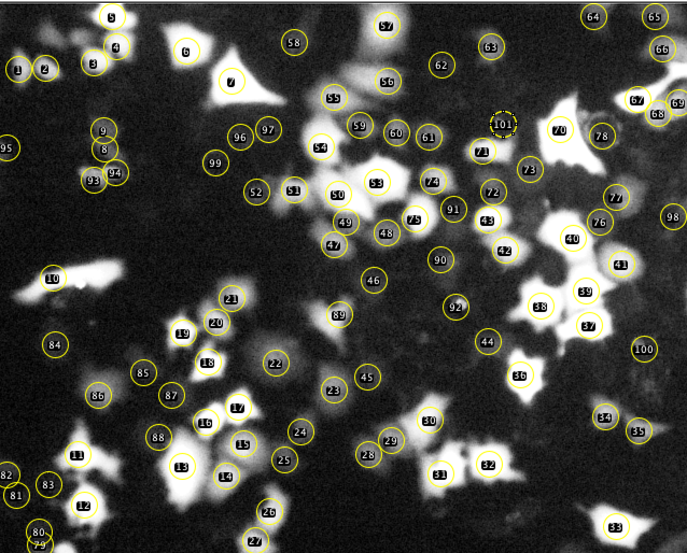
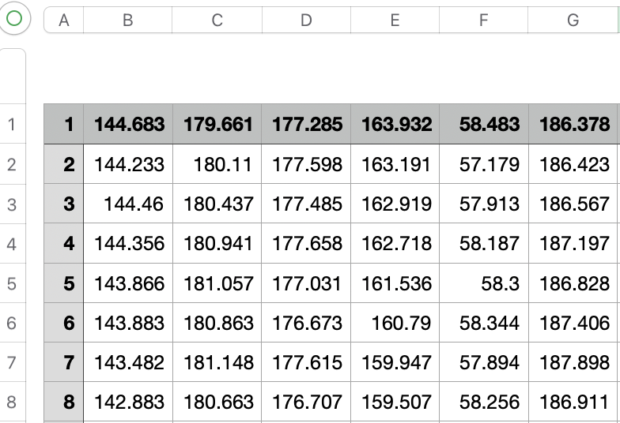
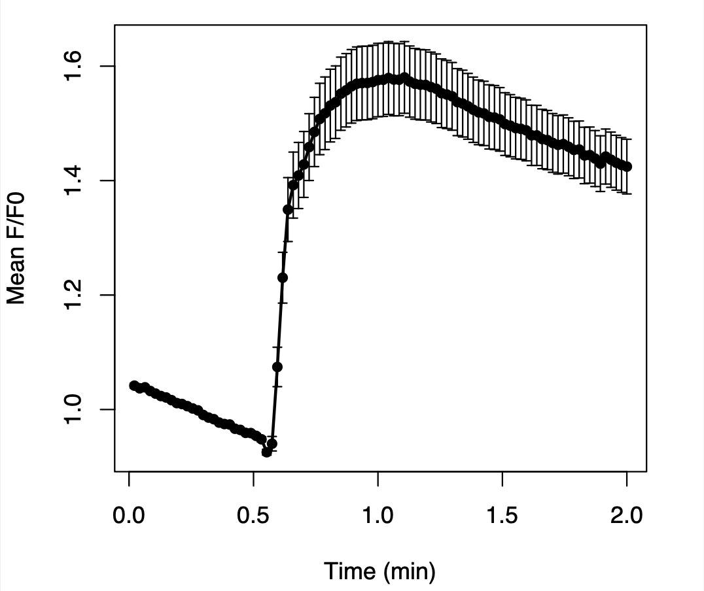
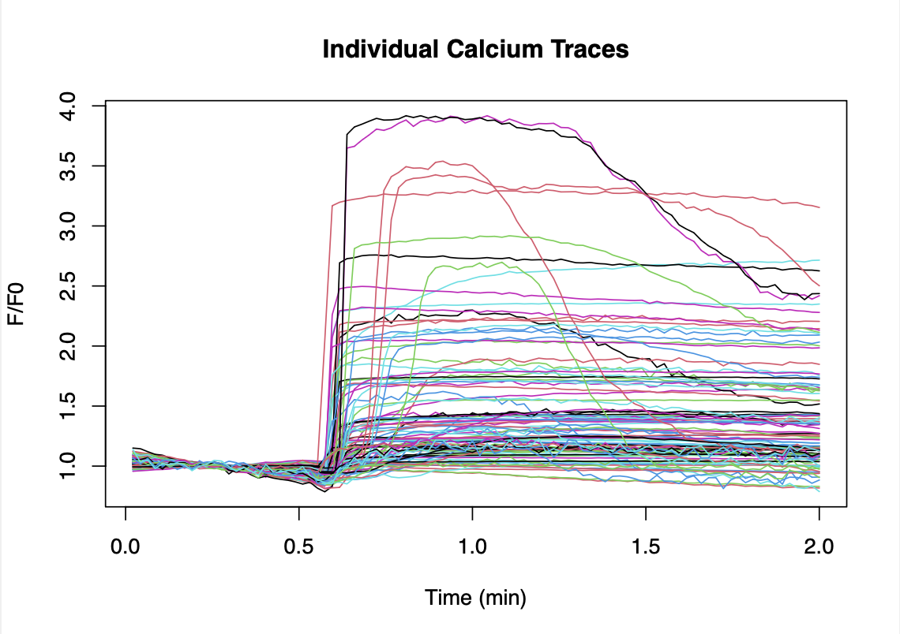

# HLCaTrace

[](https://yiyingli423.github.io/HLCaTrace/)
[](LICENSE)

HLCaTrace is an R package for calcium imaging trace analysis. It provides a reproducible workflow for F/F0 normalization, responding cell detection, timecourse summarization, and automated figure generation.

## Project website

A complete experimental and analytical walkthrough of the associated FEBS Letters study is available through the project website:

https://yiyingli423.github.io/HLCaTrace/

The website documents:

- Experimental design logic
- SERCA lockdown strategy
- Live-cell calcium imaging workflow
- ER Ca2+ uptake assays
- Confocal imaging analysis
- Fiji/ImageJ fluorescence extraction
- Reproducible analysis using the HLCaTrace R package
- Personal reflection and workflow development

## Background

HLCaTrace was developed from calcium signaling analysis workflows used in live-cell fluorescence imaging experiments. The package converts previously Excel-based calcium imaging analysis steps into a reproducible R-based pipeline.

The workflow is designed for single-cell calcium traces, where each column represents one cell and each row represents one imaging frame. The package was developed to improve reproducibility, scalability, and automation in calcium imaging analysis workflows that were previously performed manually in Excel.

The package was developed as part of the live-cell calcium imaging analysis workflow used in the following study:

Li, Y., & Hamada, K. (2026). *Genetically encoded lockdown of SERCA in the endoplasmic reticulum membrane arrests Ca2+ signaling through proximity-covalent crosslinking*. *FEBS Letters*. Advance online publication. DOI: [10.1002/1873-3468.70342](https://doi.org/10.1002/1873-3468.70342)

## Experimental imaging workflow

### Imaging system

Calcium imaging experiments were performed using a Nikon Eclipse Ti-S inverted widefield fluorescence microscope.

Typical acquisition settings:

- 20× objective
- 300 ms exposure time
- ~1.3 sec/frame
- 2 min total recording time

### Calcium indicators

The workflow was developed using:

- NCaMP7 for cytosolic calcium imaging

### Experimental stimulation

Typical stimulation conditions:

- Histamine (100 µM) for HeLa cells
- Carbachol (0.5 mM) for HEK293FT cells

Agonists were added at 30 sec after recording initiation.

## ROI extraction in Fiji/ImageJ

Fluorescence traces were extracted manually in Fiji/ImageJ using ROI-based measurements.

### Example ROI selection

<div align="center">

</div>

### Example exported fluorescence CSV

<div align="center">

</div>

The package assumes:

- Column 1 = frame number
- Remaining columns = individual cells
- Rows = imaging frames

A standard example dataset is included in:

```r
system.file("extdata", "raw_traces.csv", package = "HLCaTrace")
```

## Features

- Import raw calcium imaging fluorescence traces
- Calculate F0 from user-defined baseline frames
- Perform F/F0 normalization
- Calculate Fmax and peak heights
- Detect responding cells using 5SD, 7SD, and 10SD thresholds
- Summarize population-level timecourse statistics
- Generate individual trace plots
- Generate mean ± SEM plots
- Export analysis results as CSV and PDF files

## Installation

```r
install.packages("devtools")
devtools::install_github("YiyingLi423/HLCaTrace")
```

Then load the package:

```r
library(HLCaTrace)
```

## Basic usage

```r
results <- run_calcium_analysis(
  file = "raw_traces.csv",
  output_prefix = "calcium_analysis",
  f0_range = 1:23,
  peak_range = 57:128,
  baseline_sd_range = 34:56,
  total_time_sec = 120
)
```

## Example output

### Mean ± SEM calcium response

<div align="center">

</div>

### Individual calcium traces

<div align="center">

</div>

## Output files

The workflow automatically generates:

```text
calcium_analysis_normalized_traces.csv
calcium_analysis_cell_summary.csv
calcium_analysis_count_summary.csv
calcium_analysis_timecourse_summary.csv
calcium_analysis_individual_traces.pdf
calcium_analysis_mean_sem.pdf
calcium_analysis_linear_regression_summary.csv
```

## Main functions

| Function | Description |
|---|---|
| `import_calcium_data()` | Import raw calcium imaging data |
| `normalize_traces()` | Perform F/F0 normalization |
| `detect_responding_cells()` | Detect responding cells |
| `summarize_timecourse()` | Calculate mean ± SEM statistics |
| `plot_individual_traces()` | Plot individual traces |
| `plot_mean_sem()` | Plot mean ± SEM trace |
| `run_calcium_analysis()` | Run the full workflow |

## Citation

If you use HLCaTrace in your research, please cite:

Li, Y., & Hamada, K. (2026). *Genetically encoded lockdown of SERCA in the endoplasmic reticulum membrane arrests Ca2+ signaling through proximity-covalent crosslinking*. *FEBS Letters*. Advance online publication. DOI: [10.1002/1873-3468.70342](https://doi.org/10.1002/1873-3468.70342)

## License

This project is licensed under the MIT License.
