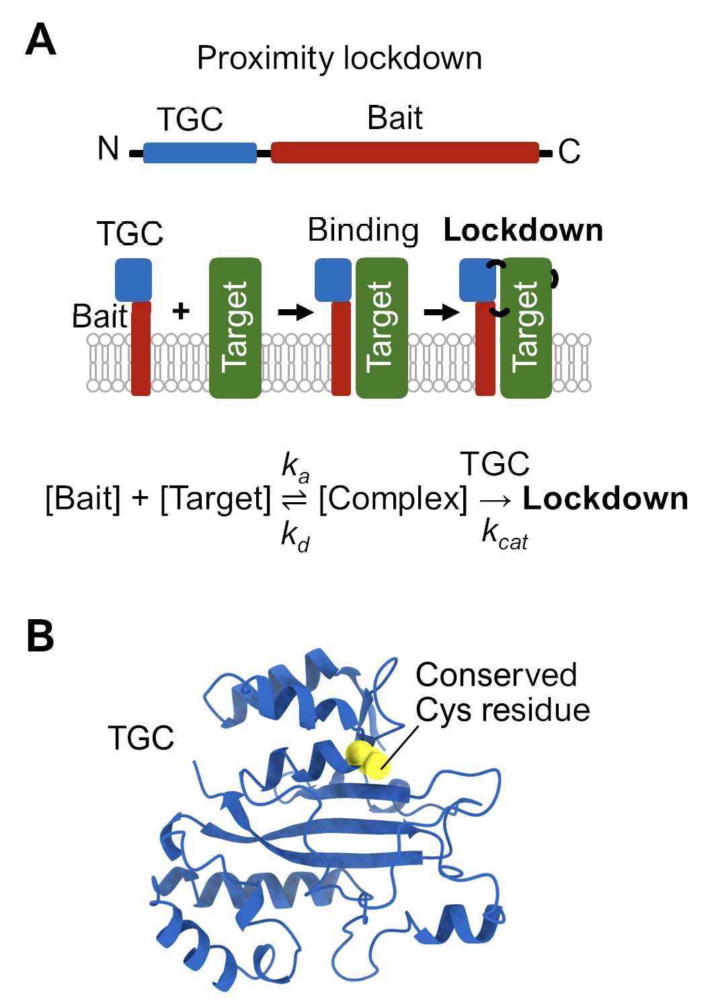
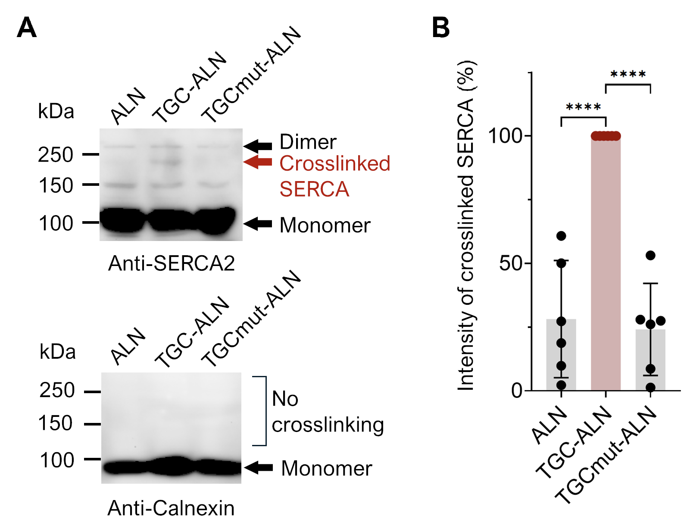
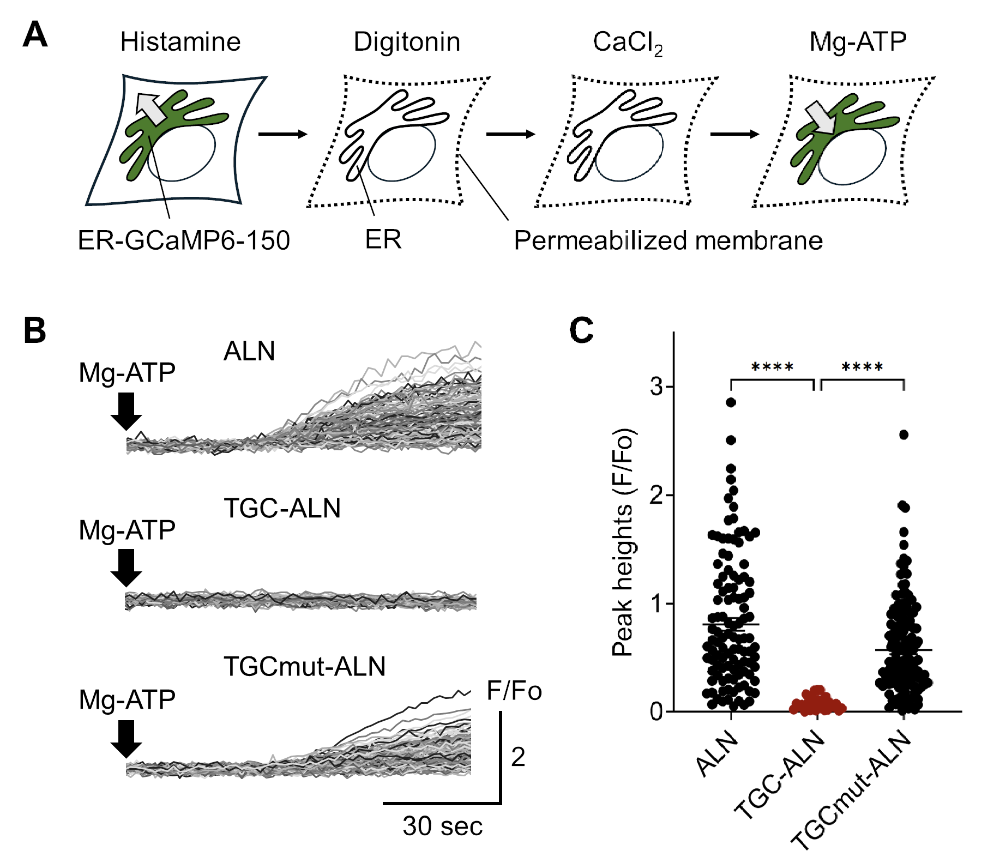
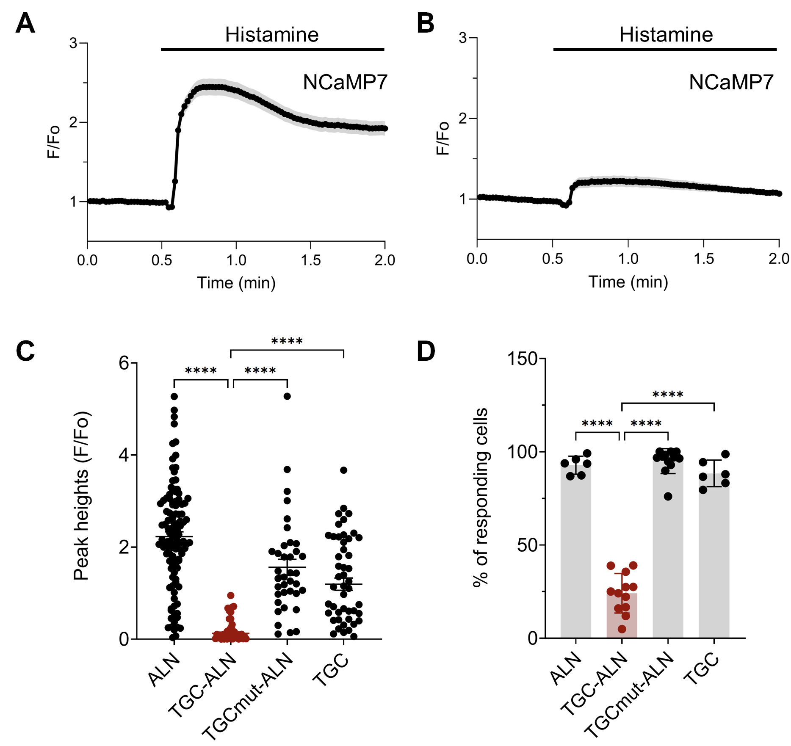
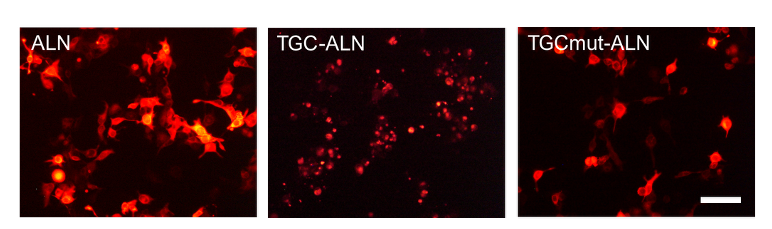
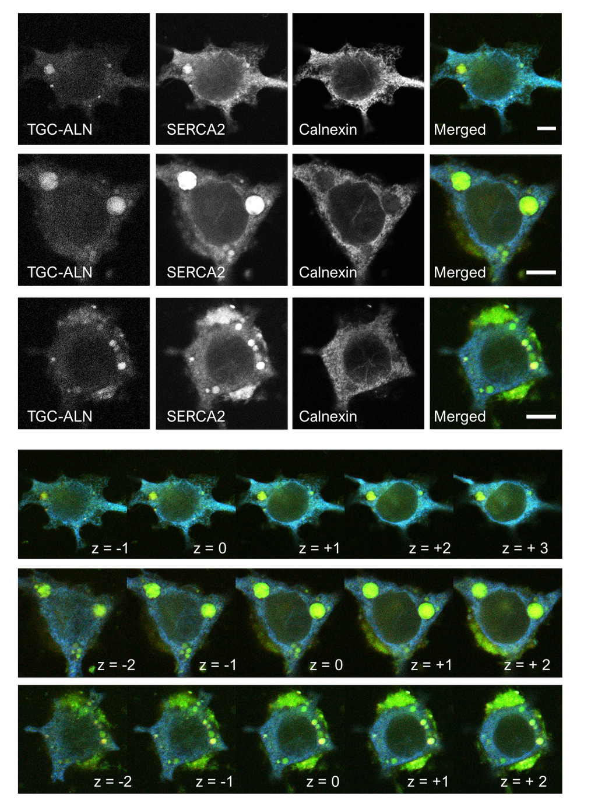

<style>

body {
  font-size: 18px;
  line-height: 1.8;
}

main.content {
  padding-top: 40px;
}

</style>

# Overview

This website presents the complete experimental and analytical logic behind the FEBS Letters study:

> Li, Y., & Hamada, K. (2026). Genetically encoded lockdown of SERCA in the endoplasmic reticulum membrane arrests Ca2+ signaling through proximity-covalent crosslinking. *FEBS Letters*. Advance online publication. https://doi.org/10.1002/1873-3468.70342

The project investigated whether membrane protein conformational dynamics could be irreversibly arrested inside living cells using a genetically encoded proximity-covalent “lockdown” system.

To address this question, an engineered transglutaminase catalytic core (TGC) was fused to the ER-resident microprotein ALN, generating an organelle-targeted enzyme capable of covalently crosslinking SERCA2 in the endoplasmic reticulum membrane.

This website reconstructs the complete experimental workflow behind the study, including:

1. Conceptual design of the lockdown strategy
2. SERCA crosslinking analysis
3. ER Ca2+ uptake assay
4. Live-cell calcium signaling analysis
5. Confocal imaging and clustering
6. Reproducible analysis workflow

The goal of this project is not only to present the biological findings, but also to document the experimental reasoning, imaging workflow, analysis pipeline, and reproducibility strategy underlying the study.


# Scientific Question

Membrane protein conformational dynamics are essential for intracellular signaling, transport, and cellular homeostasis. However, methods capable of irreversibly arresting these dynamics inside living cells remain extremely limited.

In this study, we asked the following central question:

> Can a genetically encoded proximity-covalent system irreversibly lock SERCA in the ER membrane and thereby arrest ER Ca2+ signaling?

SERCA continuously changes conformation during ATP-dependent Ca2+ transport. We hypothesized that covalent restriction of these conformational transitions would impair pump activity and suppress downstream calcium signaling.

## Lockdown system design

The lockdown strategy was designed to covalently restrict SERCA conformational dynamics directly in the ER membrane.

ALN was used as an ER-resident targeting module, while the compact microbial transglutaminase catalytic core (TGC) served as the proximity-covalent crosslinking enzyme.

This design enabled organelle-targeted covalent restriction of membrane protein motion inside living cells.

<div style="text-align:center;">



</div>

*Figure 1. Conceptual design of the ER-targeted lockdown system. TGC–ALN was engineered to promote proximity-dependent covalent crosslinking around SERCA in the ER membrane, thereby restricting ATP-dependent conformational dynamics and suppressing ER Ca2+ signaling.*


# Overall Experimental Workflow

The project combined:

- Molecular engineering
- Live-cell calcium imaging
- Permeabilized-cell ER uptake assays
- Western blot analysis
- Confocal microscopy
- Fiji/ImageJ fluorescence extraction
- Reproducible R-based calcium trace analysis

The final calcium imaging workflow was integrated into the HLCaTrace R package to standardize trace normalization, responding cell detection, timecourse analysis, and figure generation.


# Experiment 1: SERCA2 Crosslinking

To determine whether the lockdown enzyme induced covalent crosslinking around SERCA2, anti-SERCA2 immunoblot analysis was performed in HeLa cells expressing ALN, TGC–ALN, or TGCmut–ALN.

A higher-molecular-weight SERCA2-reactive species was detected specifically in the TGC–ALN condition, while control conditions showed primarily monomeric SERCA2.

<div style="text-align:center;">



</div>

*Figure 2. SERCA2 crosslinking was selectively detected in the TGC–ALN condition, supporting proximity-dependent covalent lockdown in the ER membrane.*


# Experiment 2: ATP-dependent ER Ca2+ Uptake Assay

To determine whether SERCA lockdown impaired ER calcium transport activity, permeabilized-cell ER Ca2+ uptake assays were performed using the ER-targeted calcium indicator ER-GCaMP6-150.

Following CaCl2 addition, Mg-ATP was introduced to initiate ATP-dependent SERCA-mediated ER Ca2+ uptake.

Cells expressing TGC–ALN showed strongly suppressed Mg-ATP-evoked ER Ca2+ uptake compared with ALN and TGCmut–ALN controls.

<div style="text-align:center;">



</div>

*Figure 3. ATP-dependent ER Ca2+ uptake was strongly suppressed in the TGC–ALN condition, indicating functional arrest of SERCA activity.*


# Experiment 3: Arrest of Agonist-evoked Ca2+ Signaling

To determine whether SERCA lockdown suppresses intracellular calcium signaling in living cells, cytosolic calcium responses were measured using NCaMP7 during agonist stimulation.

Histamine stimulation in HeLa cells and carbachol stimulation in HEK293FT cells induced robust calcium responses in control conditions.

In contrast, cells expressing TGC–ALN showed strongly reduced agonist-evoked calcium signaling.

<div style="text-align:center;">



</div>

*Figure 4. Agonist-evoked intracellular calcium signaling was strongly suppressed in the TGC–ALN condition.*


# Experiment 4: Intracellular Clustering and Spatial Association

## Widefield imaging of intracellular clustering

Widefield fluorescence imaging revealed prominent intracellular clustering patterns specifically in cells expressing TGC–ALN.

These clustering phenotypes were not observed in ALN or TGCmut–ALN control conditions.

<div style="text-align:center;">



</div>

*Figure 5. Widefield fluorescence imaging revealed intracellular clustering specifically in the TGC–ALN condition.*

## Confocal imaging of SERCA2 spatial association

To further examine intracellular localization, confocal imaging was performed together with SERCA2 overexpression and endogenous ER markers.

Confocal imaging demonstrated spatial association between TGC–ALN clusters, SERCA2 localization, and ER structures.

<div style="text-align:center;">

</div>

*Figure 6. Confocal imaging demonstrated spatial association between TGC–ALN, SERCA2, and ER structures.*


# Reproducible Calcium Imaging Analysis Workflow

## ROI extraction and fluorescence trace generation

Fluorescence intensity traces were extracted in Fiji/ImageJ using manually selected ROIs corresponding to individual cells.


<div style="text-align:center;">


</div>

*Figure 7. Representative ROI selection in Fiji/ImageJ for single-cell fluorescence extraction.*

The exported fluorescence CSV file contained:

- Column 1: frame number
- Remaining columns: individual cell fluorescence traces

<div style="text-align:center;">


</div>

*Figure 8. Representative fluorescence trace CSV structure exported from Fiji/ImageJ.*


## Reproducible analysis using HLCaTrace

To improve reproducibility and scalability of calcium imaging analysis, fluorescence traces were processed using the custom-developed **HLCaTrace** R package.

The workflow performs:

- F/F0 normalization
- Baseline noise estimation
- Peak response detection
- Responding cell classification
- Population timecourse summarization
- Automated figure generation

Typical analysis workflow:

```r
library(HLCaTrace)

results <- run_calcium_analysis(
  file = "raw_traces.csv",
  output_prefix = "calcium_analysis"
)
```

# Conclusion

This study demonstrates that membrane protein conformational dynamics can be irreversibly restricted inside living cells using a genetically encoded proximity-covalent lockdown strategy.

By targeting the ER-resident calcium pump SERCA, the TGC–ALN system suppressed ATP-dependent ER Ca2+ uptake, arrested agonist-evoked calcium signaling, and induced intracellular clustering associated with SERCA2 and ER structures.

Together, these experiments establish a framework for long-term covalent control of intracellular membrane protein function.


# Reproducibility and Computational Workflow

To improve reproducibility and scalability of calcium imaging analysis, the experimental workflow was integrated into the custom-developed **HLCaTrace** R package.

The package standardizes fluorescence trace normalization, responding cell detection, population timecourse analysis, and automated figure generation from Fiji/ImageJ-exported calcium imaging datasets.


# Personal Reflection

At the beginning of this project, I was resistant to converting our long-standing Excel-based calcium imaging workflow into an R-based computational pipeline. For more than two years, Dr. Kozo Hamada and I continuously refined the analysis environment through repeated experimental use and adaptation to our own imaging data and experimental needs, gradually developing a more reproducible workflow.

Eventually, the entire calcium imaging analysis workflow was consolidated into the custom-developed **HLCaTrace** R package. The name HLCaTrace stands for **Hamada–Li Ca2+ Trace**.

As a young researcher, building this package and documenting the complete experimental logic behind my first first-author research article became a meaningful starting point for the scientific work I hope to continue pursuing in the future.
